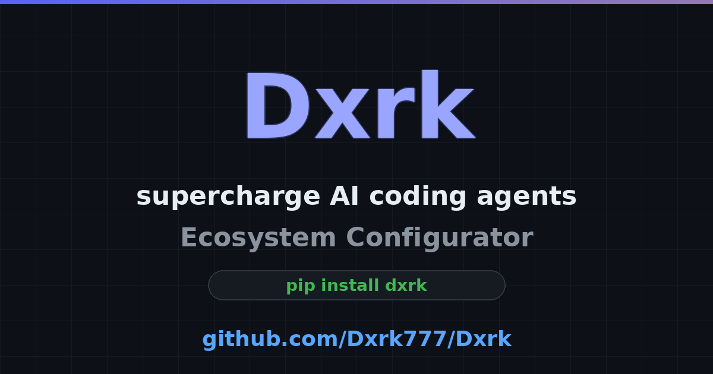
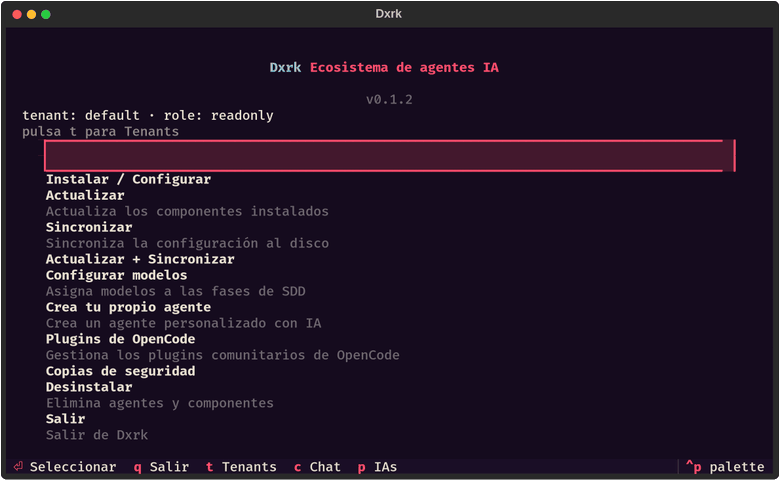

# Dxrk

<strong>Ecosistema, Frameworks y Workflows para agentes de IA</strong>



[](https://github.com/Dxrk777/Dxrk/releases/latest)
[](LICENSE)
[](https://www.python.org/downloads/)
[](docs/platforms.md)
[](https://github.com/Dxrk777/Dxrk/actions)
[](https://github.com/Dxrk777/Dxrk)

---

## Qué es Dxrk

**Dxrk** es un configurador y orquestador de ecosistemas para agentes de IA. En un solo comando instala, configura y sincroniza **42 agentes de IA**, memoria persistente, skills curadas, servidores MCP y conmutador de modelos para tu stack de desarrollo completo.



- 🐍 **Python 3.13+** con TUI moderna basada en [Textual](https://textual.textualize.io/)
- 🤖 Configura **42 agentes** con un solo comando
- 🧠 **DxrkMemory 2.0 — Flagship local-first stdlib-only** (sin `chromadb`, sin `onnx`) — `sqlite3` FTS5 `trigram`+WAL, 13 módulos 4652 LOC, hybrid BM25, Palace locks, Graph temporal, dialecto AAAK, wake-up **600–900 tok** (paridad mempalace 3.7.1) — ver [`docs/memory.md`](docs/memory.md)
- ⚡ Conmutador de proveedores y modelos con perfiles `cheap` / `balanced` / `quality`

## Instalación

> Requisito: **Python 3.13+**

```bash
pip install dxrk
```

También disponible vía `uv`:

```bash
uv tool install dxrk
```

**Desde el código fuente:**

```bash
git clone https://github.com/Dxrk777/Dxrk.git
cd Dxrk
uv sync --all-extras
uv run dxrk-py --help
```

## Uso rápido

```bash
# Instala y configura un agente con el preset completo
dxrk-py install --agent claude-code --preset full-dxrk

# Consulta tu memoria persistente
dxrk-py query "¿qué arquitectura decidimos para el módulo de memoria?"

# Cambia de proveedor de modelos
dxrk-py sync --profile cheap:openrouter/qwen/qwen3-30b-a3b:free

# Asigna modelos por fase de desarrollo
dxrk-py sync --profile-phase cheap:sdd-design:anthropic/claude-sonnet-4-20250514
```

## Por qué Dxrk

| Característica | Dxrk | Configurar a mano |
|---|---|---|
| Instalar un agente de IA | `dxrk-py install --agent claude-code` | Documentación, paths, symlinks, permisos |
| 42 agentes configurados | 1 comando | Horas de setup manual |
| Memoria persistente | `dxrk-py query "..."` | Buscar soluciones hechas a medida |
| Skills curadas + MCP | `dxrk-py skill-registry refresh` | Scraping manual de repos |
| Cambiar de proveedor | `dxrk-py sync --profile cheap:...` | Editar config de cada agente |
| Workflows Git | `/commit`, `/branch`, `/pr` | Comandos largos manuales |

## Agentes soportados (42)

| | | | |
|---|---|---|---|
| Claude Code | OpenCode | Kilo Code | Gemini CLI |
| Cursor | VS Code Copilot | Codex | Windsurf |
| Antigravity | Kimi Code | Kiro IDE | Qwen Code |
| Pi | OpenClaw | Aider | Cline |
| Roo Code | Continue | Junie | Amazon Q |
| OpenHands | Zed AI | GitHub Copilot | Devin |
| Cody | Tabnine | Replit | Void |
| Amp | Blackbox AI | Bolt.new | Conductor |
| Hermes | JetBrains AI | Looperators | Lovable |
| PearAI | Qodo | RunCell | Trae |
| v0 | ZCode | | |

## Características

- 🧠 **DxrkMemory 2.0 — Flagship top1 local-first stdlib-only** — `dxrk/memory` 13 archivos 4652 LOC `sqlite3` **FTS5 `trigram`+WAL** sin `chromadb`/sin `onnx`/sin `numpy`; `chr-join` LEGACY `dxrk_drawers` compat, `0` traces `engram`/`mempal` (979 reemplazos + 7 `git mv`), **fidelity 3.7.1** (388 files / 50+ commits `359c579`): re-mine honesty `1654cd2`/`759b8f1`, FIFO `O_NONBLOCK`+`S_ISREG` `db29959`, orphan lock reap `27212e5` `~/.dxrk/locks` 900 s, `since`/`before` `5036e3c` pool 3×/15×, SIGTERM. Hybrid **BM25** + closet boost, **Graph** temporal `valid_from`/`valid_to`+`as_of`, dialecto **AAAK** `compress`/`decode`, **Layers** wake-up **600–900 tok** (L0 100 + L1 500–800) — [`docs/memory.md`](docs/memory.md) · [`docs/MIGRATION_3.3.5_3.7.1.md`](docs/MIGRATION_3.3.5_3.7.1.md) · `from dxrk.memory import AgentMemory, Palace, KnowledgeGraph` — verif. `uv run pytest tests/test_memory.py -q` **19 passed**
- ✅ **Spec-Driven Development** — workflow completo con `/sdd-init`, skill registry, hooks y permisos
- ✅ **Skills curadas** — `dxrk-py skill-registry refresh`
- ✅ **35+ servidores MCP** — configurables vía `.mcp.json`
- ✅ **Conmutador de modelos** — perfiles `cheap` / `balanced` / `quality` con asignación por fase (`sdd-design`, `spec`, `tasks`)
- ✅ **TUI Textual** — detección de agentes instalados en tiempo real
- ✅ **Workflows Git** — conventional commits, PRs con revisión automática y keybindings

## Estructura del proyecto

```text
dxrk/
├── agents/          # Adaptadores para 42 agentes de IA
├── cli/             # Interfaz de línea de comandos
├── commands/        # Comandos disponibles (/commit, /branch, ...)
├── config/          # Configuración, perfiles y feature flags
├── memory/          # DxrkMemory 2.0 flagship stdlib-only 13 módulos 4652 LOC — Palace+sqlite FTS5+Graph+Layers+AAAK+miner (ver docs/memory.md)
├── rag/             # RAG local (chunking, indexado, consulta)
├── security/        # Permisos y verificación de seguridad
├── tools/           # Herramientas de detección y utilidades
├── tui/             # Interfaz de terminal con Textual
├── mcp/             # Servidores MCP configurables
├── autonomy/        # Evolución de prompts, aprendizaje y verificación
├── scholar/         # Búsqueda académica y citas
└── utils/           # Utilidades compartidas
```

## Desarrollo

```bash
uv sync --all-extras          # Instala dependencias incl. dev
uv run pytest                 # 2760+ tests
uv run --with mypy mypy dxrk/ # Verificación de tipos
```

## FAQ

**¿Necesito un agente específico para usar Dxrk?**
No. Dxrk configura tu ecosistema completo; úsalo con los agentes que ya tienes instalados.

**¿Dxrk guarda mis datos?**
La memoria es local y persistente; los proveedores de modelos se configuran con tus propias API keys.

**¿Funciona en Windows?**
Sí, macOS, Linux y Windows (ver [platforms.md](docs/platforms.md)).

**¿Cómo cambio de modelo en mitad de un proyecto?**
`dxrk-py sync --profile <perfil>` y Dxrk actualiza la configuración de todos los agentes.

## Roadmap

- **v0.2.0** — Pipeline de entrenamiento ML, pre-commit hooks y Dependabot
- **v0.5.0** — Marketplace de plugins
- **v1.0.0** — Multi-tenant y estabilización de API

## Documentación

| Documento | Descripción |
|---|---|
| [memory.md](docs/memory.md) | **DxrkMemory 2.0 flagship** — 13 módulos, sqlite FTS5, Palace locks, BM25, Graph, AAAK, Layers 600–900 tok |
| [MIGRATION_3.3.5_3.7.1.md](docs/MIGRATION_3.3.5_3.7.1.md) | Migración mempalace 3.3.5 → 3.7.1 — delta 388 files, parches portados |
| [intended-usage.md](docs/intended-usage.md) | Uso previsto del proyecto |
| [agents.md](docs/agents.md) | Adaptadores de agentes |
| [components.md](docs/components.md) | Componentes internos |
| [architecture.md](docs/architecture.md) | Arquitectura del sistema |
| [usage.md](docs/usage.md) | Guía de uso |
| [platforms.md](docs/platforms.md) | Plataformas soportadas |

## Licencia

[MIT](LICENSE)

---

**DXRK // BEYOND LIMITS**
