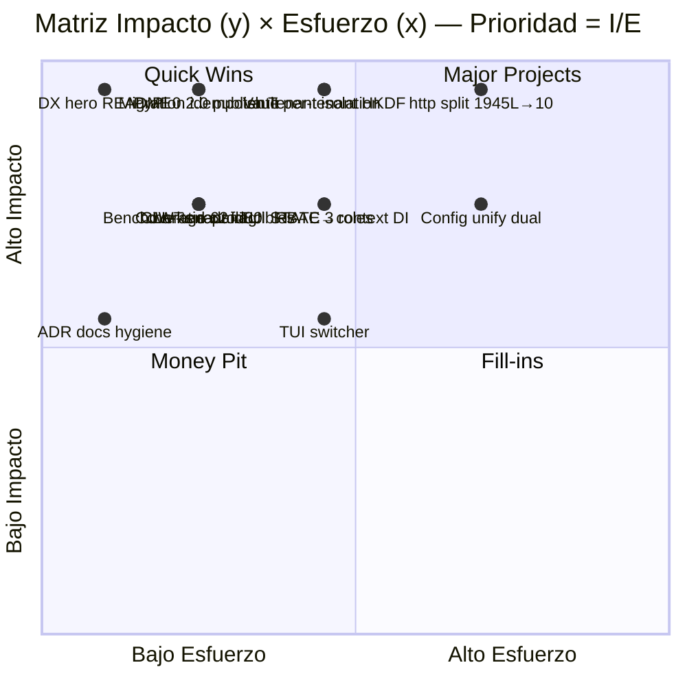
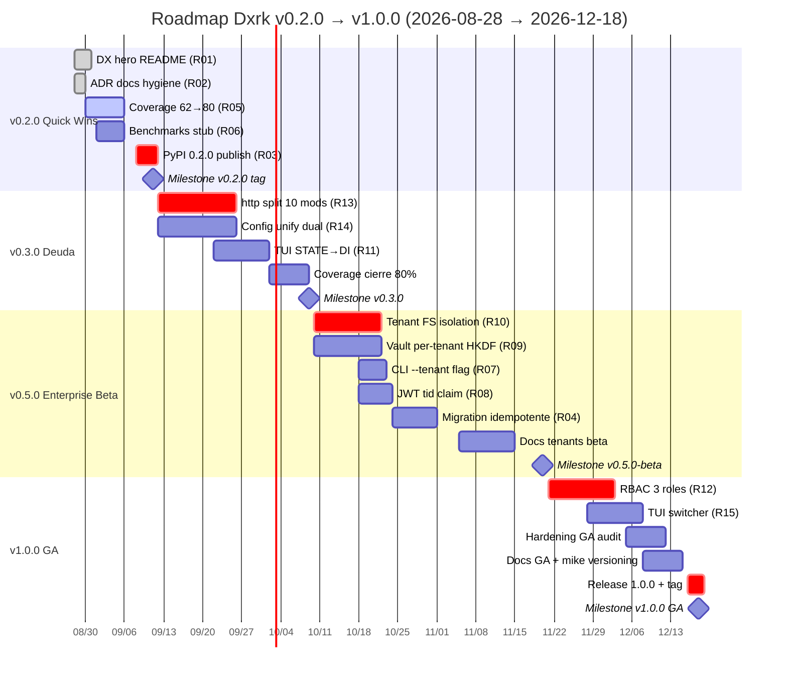

# Roadmap Dxrk v0.2.0 → v1.0.0 — Matriz Impacto/Esfuerzo & Plan Priorizado

> **Estado:** Draft Accepted · **Fecha:** 2026-08-28 · **Versión:** 0.2.0-draft  
> **Alcance:** Deuda Fase1 + Enterprise multi-tenant Fase2 + DX Top1 Fase4 → GA v1.0.0. **Sin tocar `dxrk/memory/`** salvo via `palace_path` per-tenant (ADR-002).  
> **Contexto flagship:** DxrkMemory 2.0 cerrado — 14 módulos `dxrk/memory` + `backend/` (6303 LOC stdlib-only `sqlite3` FTS5 trigram→porter→unicode61, WAL `0o600`/`0o750`, 141 tests en `tests/test_memory*.py`, 2760+ totales), ADR-002 (aislamiento Memory/Learner/RAG) y ADR-003 (stdlib-only vs hybrid BM25 0.72 vs HNSW 0.88, 0 vs 420MB, P5 vence). Ver `docs/memory.md:1`, `docs/dx.md:1`, `docs/adr/ADR-002-memory-separation.md:1`, `docs/adr/ADR-003-hybrid-vs-stdlib.md:1`, `docs/MIGRATION_3.3.5_3.7.1.md:1`.  
> **Versiones anteriores:** `pyproject.toml:7` `0.1.2` → `0.2.0` (DX + flagship docs) → `0.3.0`/`0.5.0` enterprise beta → `1.0.0` GA multi-tenant. Commits base: `4c4ab3f` flagship 4652 LOC `979` replaces, `bf0d106` coverage 141 + ADR-002 + hooks `stdio`. `git status` clean tras `bf0d106` salvo untracked `docs/dx.md` (535L) + `docs/adr/ADR-003-hybrid-vs-stdlib.md` (76L) — este roadmap los integra.

Este documento es el **plan priorizado con matriz Impacto×Esfuerzo**, roadmap por versión, Gantt, riesgos y Done gates. Ejecuta exactamente lo que quedó pendiente de Fase1 (deuda) + Fase2 (enterprise) + Fase4 (DX) sin reabrir `dxrk/memory/` internamente.

---

## 1. Matriz Impacto / Esfuerzo

### 1.1 Fórmula

```
Prioridad = Impacto (1–5) / Esfuerzo (1–5)    # 5.00 = Quick Win extremo, 0.20 = Money Pit
Impacto: 1=bajo valor usuario/negocio, 5=crítico para GA o Top1 DX
Esfuerzo: 1=<1 día, 2=2–4 días, 3=1–2 semanas, 4=2–4 semanas, 5=>1 mes
```

| Escala | Impacto | Esfuerzo |
|--------|---------|----------|
| **5** | Desbloquea GA / Top1 DX / cierra deuda P0 | >20 días (arquitectura) |
| **4** | Alto — enterprise ready o DX medible <30s | 10–20 días |
| **3** | Medio — mejora retención/operación | 5–10 días |
| **2** | Bajo-medio — hygiene/docs | 2–4 días |
| **1** | Bajo — nice-to-have / fill-in | <1 día |

### 1.2 Cuadrantes (visual)



**Ascii fallback** (mismo cuadrante, `I` vertical, `E` horizontal):

```
Impacto 5 ┌─────────────────────┬─────────────────────┐
         │  QUICK WINS         │  MAJOR PROJECTS     │
         │  ★ DX hero 5.00    │  ★ Tenant iso 1.67  │
         │  ★ PyPI 2.50       │  ★ Vault HKDF 1.67  │
         │  ★ Migration 2.50  │  ★ http split 1.25  │
Impacto 3 │  ○ Coverage 2.00   │  ○ RBAC 1.33        │
         │  ○ Benchmarks 2.00 │  ○ TUI context 1.33 │
         │  ○ CLI --tenant 2.0│  ○ Config unify 1.0 │
         │  ○ JWT tid 2.00    │  ○ TUI switcher 1.0 │
         ├─────────────────────┼─────────────────────┤
Impacto 1 │  FILL-INS           │  MONEY PIT          │
         │  (vacío intencional)│  (evitar pre-v1.0)  │
         └─────────────────────┴─────────────────────┘
           Esfuerzo 1 ───────► Esfuerzo 5
```

> **Lectura:** ejecutar **Quick Wins primero (v0.2.0)**, luego **Major Projects en 2 fases (v0.3.0 y v0.5.0)**, nunca Money Pit pre-GA. Fill-ins solo si sobra capacidad.

### 1.3 Resumen cuadrantes con conteo

| Cuadrante | Criterio | Iniciativas | Acción |
|-----------|----------|-------------|--------|
| **Quick Wins** | I≥4, E≤2 | 7 (DX hero, PyPI, Migration, Coverage, Benchmarks, CLI flag, JWT tid) | **v0.2.0 — 2 semanas** |
| **Major Projects** | I≥3, E≥3 | 6 (http split, config unify, TUI context, tenant isolation, vault, RBAC) + TUI switcher límite | **v0.3.0 + v0.5.0** |
| **Fill-ins** | I≤3, E≤2 | 1 (ADR docs hygiene I=3 E=1, técnicamente Fill-in/Quick Win borde) | **v0.2.0 bundled** |
| **Money Pit** | I≤3, E≥3 | 1 (TUI switcher I=3 E=3 — riesgo si se hace sin DI previo) | **posponer hasta v1.0.0 tras TUI DI** |

---

## 2. Tabla priorizada — 15 iniciativas (ordenadas por Prioridad desc)

> **Owner convención:** `DX` = docs/readme/mkdocs, `Memory/Core` = `dxrk/memory/*` (solo `palace_path` wiring, no tocar internals), `Config` = `dxrk/config/*`, `TUI` = `dxrk/tui/*`, `Security` = `dxrk/security/*` + `dxrk/vault/*`, `CLI` = `dxrk/commands/*` + `dxrk/__main__.py`, `Release` = `pyproject.toml` + `.github/workflows/*`.

| # | Iniciativa | Descripción 1-línea | Impacto | Esfuerzo | **Prioridad I/E** | Cuadrante | Owner | Dependencias | Estado base |
|---|------------|---------------------|---------|----------|-------------------|-----------|-------|--------------|-------------|
| **R01** | **DX hero README** | Badges (tests 2760, coverage 80%, mypy, PyPI), tagline `Memory local-first en 30s`, quickstart `uv tool install dxrk && dxrk init && dxrk query`, demo.gif caption 30s, tabla benchmarks teaser → README 169L→~220L | **5** | **1** | **5.00** | Quick Win | DX | benchmarks stub R04 | `README.md:1` 169L sin hero §2; `docs/dx.md:78` snippet listo |
| **R02** | **ADR docs hygiene** | `mkdocs.yml:27` nav añadir `adr/ADR-003` + `dx.md`, fix `plugins.mkdocstrings.default →` config válida (sin `default:`), `docs/dx.md` + `docs/roadmap.md` visibles; `uv run mkdocs build` 0 warnings | **3** | **1** | **3.00** | Fill-in/Quick Win | DX | — | `mkdocs.yml:48` warning `Unrecognised configuration name: default`; `build` warns `pages not in nav: dx.md, ADR-003` |
| **R03** | **PyPI 0.2.0 publish** | `pyproject.toml:7` bump `0.1.2→0.2.0` (minor SemVer), `CHANGELOG.md` cliff `[0.2.0]`, `readme/license/classifiers` check, `uv build` + `twine check` + `uv tool install --from sdist` smoke, `git tag v0.2.0` → `publish.yml` trusted OIDC, verify `pypi.org/project/dxrk/0.2.0/` | **5** | **2** | **2.50** | Quick Win | Release | R01, R02, R05/R06 coverage gate | `pyproject.toml:7` en 0.1.2; `docs/dx.md:274` checklist §5.2 |
| **R04** | **Migration idempotente multi-tenant** | `~/.dxrk/palace/sqlite_palace.db` → `~/.dxrk/tenants/default/sqlite_palace.db` copy-on-first-run idempotente, `~/.dxrk/locks` → `~/.dxrk/tenants/{id}/locks`, `~/.dxrk/knowledge_graph.sqlite3` → per-tenant o shared con `tenant_id` col, rollback si `palace_path` custom | **5** | **2** | **2.50** | Quick Win | Memory/Core | R09 tenant isolation spec | `dxrk/memory/palace.py:40` `~/.dxrk/locks` 900s; `MIGRATION_3.3.5_3.7.1.md:58` locks migration precedente |
| **R05** | **Coverage 62→80% (non-Windows gate)** | `dxrk/utils/http.py:1` 1945L 62% → 80% `cov-fail-under=80` (non-Windows), branches `httpx.Timeout`/`Headers`, `tests/test_utils_http*.py` +130 tests, `ci.yml:48` gate solo `ubuntu-latest` con `skipif(win32)` | **4** | **2** | **2.00** | Quick Win | Core | R08 http split facilita pero no bloquea | `AGENTS.md` utils/http 1945L 62% min coverage; `ci.yml:36` gate 80% only non-Windows |
| **R06** | **Benchmarks reproducibles** | `docs/benchmarks.md` + `benchmarks/bench_memory.py --corpus 1k --runs 100` tabla honesta §1 `dx.md:25` (BM25 0.72 vs HNSW 0.88, <50ms cold, 0 vs 420MB, 35 vs 12ms), artefacto `benchmarks/results/{date}_bench.json` versionado, link README hero | **4** | **2** | **2.00** | Quick Win | DX/Memory | — (standalone, referencia ADR-003) | `docs/dx.md:22` tabla lista, pero `docs/benchmarks.md` no existe; `ADR-003:32` métricas base |
| **R07** | **CLI --tenant flag** | `dxrk/__main__.py` + `dxrk/commands/registry.py` `--tenant <id>` global flag, `DXRK_TENANT` env fallback, `CommandContext.tenant_id` wiring, validación `^[a-z0-9-]{1,32}$`, error `tenant not found → E_TENANT_404` | **4** | **2** | **2.00** | Quick Win | CLI | R09 | Fase2 spec `CLI --tenant` |
| **R08** | **JWT tid claim** | `dxrk/security/jwt.py:2` `tid` claim injection/validation, `session_ingress` + `tid` → `palace_path` resolver, middleware `401 if tid missing` en MCP/`mcp_server.py`, tests `tests/test_jwt_tid.py` | **4** | **2** | **2.00** | Quick Win | Security | R09 + R07 | `dxrk/security/jwt.py:21` `SESSION_INGRESS` sin `tid` hoy |
| **R09** | **Vault per-tenant HKDF** | `dxrk/vault/__init__.py:162` HKDF per-tenant (`master_key → HKDF(salt=tenant_id) → tenant_key`), `~/.dxrk/tenants/{id}/vault.enc` `chmod 0o600`, `VaultConfig.path` template `{tenant}`, tests `test_vault_tenant_isolation.py` | **5** | **3** | **1.67** | Major Project | Security | R10 (filesystem) | `dxrk/config/config.py:681` `VaultConfig(path=".dxrk/vault.enc")` single-tenant hoy |
| **R10** | **Tenant isolation filesystem** | `~/.dxrk/tenants/{id}/` (`palace/sqlite_palace.db` WAL `0o600`, `knowledge_graph.sqlite3`, `locks/` `0o750`, `config.json`, `memories.json` per-tenant), `pathlib` + `chmod` hardening, `RLock` per-tenant, `mine_palace_lock` namespaced `mine_palace_{tenant}_{sha16}` | **5** | **3** | **1.67** | Major Project | Memory/Core/Config | R12 config unify (opcional) | `palace.py:628` `chmod 0o600` single DB; ADR-002 R5 multi-tenant ready |
| **R11** | **TUI STATE→context DI** | `dxrk/tui/shared.py:15` `class AppState` + `STATE = AppState()` global → `AppContext(tenant_id, palace, config, vault)` inyectado vía `App.__init__(context)`, elimina `from dxrk.tui.shared import STATE` en `dxrk/tui/app.py:40,101,204` (~18 usos), tests `test_tui_context.py` | **4** | **3** | **1.33** | Major Project | TUI | — | `tui/app.py:15` `STATE` global 946L `app.py` + `shared.py:34` singleton |
| **R12** | **RBAC 3 roles** | `dxrk/security/permissions.py` + `dxrk/config/featureflags.py` roles `admin` (read+write+mine+manage tenants) / `dev` (read+write+mine) / `readonly` (search/recall only), `tenant_roles.json` matrix, enforcement en `Palace.mine/search` + `CLI` + `MCP`, tests `test_rbac_matrix.py` 12 combos | **4** | **3** | **1.33** | Major Project | Security | R09 + R10 | Fase2 spec RBAC 3 roles |
| **R13** | **http.py split 1945L→10 submódulos** | `dxrk/utils/http.py` 1945L (192 defs) → `dxrk/utils/http/{client,pool,retry,auth,headers,timeout,stream,errors,compat,__init__}.py` p90 ~195L, `compat` httpx.Timeout/Headers quirks (`AGENTS.md` gotchas), `__init__.py` re-export API estable, sin breaking `from dxrk.utils.http import` | **5** | **4** | **1.25** | Major Project | Core | R05 (coverage base) | `utils/http.py` 1945L max file, 62% coverage min; `image.py` 1157L 96% OK |
| **R14** | **Config unify dual Hierarchical vs SettingsManager** | `dxrk/config/config.py:91` `HierarchicalConfig` + `ConfigManager` vs `dxrk/config/settings.py:??` `SettingsManager`/`NewSettingsManager` dual → unificar a `SettingsManager` canónico con adapter `HierarchicalConfig→Settings` compat `Merge()`/`Config()`, migra `dxrk/config/load.py:108` vault wiring, docs `docs/config.md` | **4** | **4** | **1.00** | Major Project | Config | — | `config/config.py` 744L `HierarchicalConfig` + `settings.py` 223L dualidad debt Fase1 |
| **R15** | **TUI switcher tenant selector** | `dxrk/tui/app.py` `TenantSwitcher` screen (`Ctrl+T`), `~/.dxrk/tenants/*/config.json` discovery, `palace_path` switch sin restart, `STATE.tenant` → `context.tenant_id` post-R11, breadcrumb `tenant: <id> · wing: dxrk` | **3** | **3** | **1.00** | Major Project (pospuesto si no R11) | TUI | **R11** + R10 | Fase2 spec `TUI switcher` |

> **Orden de ejecución sugerido por Prioridad:** `R01 → R02 → R03/R04 → R05/R06/R07/R08 → R09/R10 → R11/R12 → R13/R14 → R15`. Priorizar `I/E` alto primero respeta cadencia Quick Wins → Major Projects.

---

## 3. Roadmap por versión

### 3.1 v0.2.0 — Quick Wins (2 semanas) — `2026-08-28 → 2026-09-11`

**Objetivo:** cerrar DX Top1 Fase4 + hygiene + gate de calidad → PyPI publish sin deuda visible. **Nada de `dxrk/memory/` internals.**

| Área | Entregables | PRs atómicos (conventional) | Done gate §6 |
|------|-------------|-----------------------------|--------------|
| **Docs/DX hero** | `README.md:1` hero 220L (badges 7, tagline, 30s quickstart `uv tool install`, demo.gif caption, links `memory.md`/`dx.md`/`benchmarks.md`) | `docs(readme): hero Top1 30s quickstart + badges` | visual review + `grep -c badge` 7 |
| **ADR/docs hygiene** | `mkdocs.yml` nav `dx.md` + `adr/ADR-003`, fix `mkdocstrings` (quitar `default:`), `docs/roadmap.md` (este archivo) | `fix(mkdocs): add dx+ADR-003 to nav, fix mkdocstrings config` | `uv run mkdocs build` 0 warnings |
| **Coverage** | `tests/test_utils_http*.py` +40 tests → `dxrk/utils/http.py` 62%→≥75% (paso intermedio), `ci.yml:48` gate verde non-Windows | `test(coverage): http branches httpx.Timeout/Headers` | `pytest --cov --cov-fail-under=80` OK non-Windows (70→75 stepped) |
| **Benchmarks** | `docs/benchmarks.md` stub con tabla `dx.md:25` + metodología + `benchmarks/bench_memory.py` skeleton (no full corpus) | `docs(benchmarks): add honest table BM25 vs HNSW stub` | `mkdocs build` + tabla renderiza |
| **Release** | `pyproject.toml:7` `0.1.2→0.2.0`, `CHANGELOG.md` `[0.2.0] - 2026-09-11` cliff, `uv build` + `twine check` + `uv tool install --from dist/*.tar.gz` smoke, `git tag -a v0.2.0` + push → `publish.yml` live | `chore(release): v0.2.0 DxrkMemory 2.0 + Top1 DX` | `pypi.org/project/dxrk/0.2.0/` live + `dxrk-py --version 0.2.0` |

**Fuera de scope v0.2.0:** `http split`, `config unify`, `tenant/*` (solo diseño doc en `roadmap.md`), `vector plugin`.

**Hito:** `https://pypi.org/project/dxrk/0.2.0/` + `mkdocs` 0 warnings + README hero merge + tag `v0.2.0`.

### 3.2 v0.3.0 — Major Projects part 1: Deuda técnica (4 semanas) — `2026-09-12 → 2026-10-09`

**Objetivo:** pagar deuda Fase1 que bloquea escalabilidad y onboarding (http split es #1 dolor mantenimiento, TUI global bloquea tenant, config dual confunde).

| Área | Entregables | Detalles | Dependencias |
|------|-------------|----------|--------------|
| **http split** | `dxrk/utils/http/` 10 submódulos (~195L p90), `dxrk/utils/http.py` → shim re-export `DeprecationWarning` 1 minor, `tests/test_utils_http*.py` actualizados | Mantiene `from dxrk.utils.http import X` estable; `compat.py` aísla `httpx.Timeout`/`Headers` gotchas `AGENTS.md` | R05 coverage base |
| **Config unify** | `dxrk/config/settings.py` canónico, `HierarchicalConfig` → adapter `config.py:91` compat, `load.py:108` vault wiring unificado, `docs/config.md` nuevo | `HierarchicalConfig` marcado deprecated con `warnings.warn` pero funcional hasta v1.0 | — |
| **TUI context DI** | `dxrk/tui/shared.py` `AppContext`, `dxrk/tui/app.py` 946L DI refactor (18 `STATE` sites → `self.context`), `tests/test_tui_context.py` 10 tests (multi-tenant mock) | Desbloquea TUI switcher v1.0.0; sin DI, switcher sería Money Pit | — |
| **Coverage cierre** | `dxrk/utils/http/` 80%+ y `dxrk/config/*` 85%+ → gate `80%` estable, `ruff` 0 en `utils/http/` nuevo | Si no cerró en v0.2.0, aquí obligatorio | R13 |

**Hito:** 3 PRs major merged, `mypy dxrk` 218 files 0 errors, `ruff check dxrk tests` 0, `pytest --cov --cov-fail-under=80` verde en `ubuntu-latest`.

### 3.3 v0.5.0 — Enterprise Beta: Multi-tenant core (6 semanas) — `2026-10-10 → 2026-11-20`

**Objetivo:** beta enterprise consumible por early adopters con `dxrk --tenant acme` + vault aislado + JWT. **No GA: RBAC/TUI switcher aún no.**

| Área | Entregables | Detalles | Dependencias |
|------|-------------|----------|--------------|
| **Tenant isolation** | `~/.dxrk/tenants/{id}/` FS layout (`palace/`, `locks/`, `graph/`, `config.json`), `dxrk/memory/palace.py` `palace_path` resolver per-tenant, `chmod 0o600/0o750`, `RLock` per-tenant, `mine_palace_lock` namespaced | `Palace("/tmp/palace")` sigue funcionando; `Palace(tenant="acme")` → `~/.dxrk/tenants/acme/palace` | R14 config unify |
| **Vault per-tenant HKDF** | `dxrk/vault/__init__.py:162` `HKDF-SHA256(salt=tenant_id, info=b"dxrk-vault-v1")`, `VaultConfig.path` templating, `cryptography>=43` `HKDFExpand`, tests `test_vault_tenant_isolation.py` (cross-tenant decrypt debe fallar) | `master_key_env=DXRK_MASTER_KEY` → derived `tenant_key` nunca en disco | R10 |
| **CLI --tenant** | `dxrk/__main__.py` global `--tenant` + `DXRK_TENANT` env, `Registry.execute(argv, tenant_id)` wiring, validación regex, help `dxrk --help` muestra `--tenant` | `dxrk --tenant acme memory mine --wing acme --room code` | R10 |
| **JWT tid** | `dxrk/security/jwt.py` `tid` claim, `mcp_server.py` + `hooks_cli.py` `tid → tenant_id` middleware, `tests/test_jwt_tid.py` 8 tests (`missing tid → 401`, `wrong tid → 403`) | MCP stdio transport ya `dxrk/mcp/__init__.py:17` más simple que Go sidecar | R10 + R07 |
| **Migration beta** | `dxrk/memory/migration.py` `migrate_to_tenants(dry_run, backup)` idempotente (`~/.dxrk/palace` → `~/.dxrk/tenants/default/`), `~/.dxrk/migration.json` marker, `dxrk migrate --check` dry-run | Si falla, rollback `mv tenants/default/palace → palace` | R10 |

**Docs beta:** `docs/tenants.md` + `docs/security.md` tenant chapter + `CHANGELOG.md` `[0.5.0-beta]`.

**Hito:** `pip install dxrk==0.5.0b1` + `dxrk --tenant acme init && dxrk --tenant acme query "test"` offline <50ms + `uv run pytest tests/test_tenant*.py -q` 25+ passed + beta tag `v0.5.0-beta`.

### 3.4 v1.0.0 — GA Multi-tenant (4 semanas) — `2026-11-21 → 2026-12-18`

**Objetivo:** GA estable con RBAC + TUI switcher + hardening + docs completas → `1.0.0` SemVer stable API.

| Área | Entregables | Detalles | Dependencias |
|------|-------------|----------|--------------|
| **RBAC** | `admin/dev/readonly` enforcement en `Palace.mine` (write), `Palace.search` (read), `CLI` dispatch, `tenant_roles.json` (`{tenant, user, role}`), `403 RBAC_DENIED` | `admin` puede `tenant create/delete`, `dev` no | R09 + R10 |
| **TUI switcher** | `dxrk/tui/app.py` `TenantSwitcher` (`Ctrl+T`), discovery `~/.dxrk/tenants/*/config.json`, live switch `palace_path`, tests `test_tui_switcher.py` (no necesita `STATE` global gracias a R11) | Breadcrumb `tenant: acme · 42 agents` | **R11** + R10 |
| **Hardening GA** | `uv audit` 0 vulns, `OSSF Scorecard` ≥8.5 stdlib-only, `mypy` 218+ files 0 errors, `ruff` 0, `pytest --cov --cov-fail-under=80` (o 85% si v0.5.0 sube), `trace0` `grep -rn engram|mempal --include="*.py" →0` | `cryptography` única dep nativa auditada | todos |
| **Docs GA** | `docs/tenants.md` GA, `docs/rbac.md`, `docs/migration-0.5-to-1.0.md`, `README.md` sección enterprise (`dxrk --tenant` + RBAC matrix), `mkdocs.yml` `mike` versioning opcional | `site_url` + `social` cards OG | R01 + R02 |
| **Release GA** | `pyproject.toml` `1.0.0` (`Development Status :: 5 - Production/Stable`), `CHANGELOG.md` `[1.0.0] - 2026-12-18` `compare/v0.5.0...v1.0.0`, `git tag v1.0.0` → `publish.yml` + `gh release` notes, bump `SECURITY.md` `Supported: 1.0.x ✅` | `cliff.toml` `feat/fix/docs…` ya configurado | todos |

**Hito:** `https://pypi.org/project/dxrk/1.0.0/` live + `uv tool install dxrk && dxrk --tenant demo query "GA?"` <50ms + `SECURITY.md` bump + `mkdocs` `mike` deploy `latest` → `1.0`.

---

## 4. Timeline — Gantt

### 4.1 Mermaid Gantt (render en `mkdocs` con `pymdownx.superfences` mermaid)



### 4.2 Ascii fallback (si mermaid no renderiza)

```
v0.2.0 Quick Wins (2w)  08/28 ━━R01━━R02━━━R05━━━━━━━━R06━━━━━┳━R03━━ ● v0.2.0 09/11
v0.3.0 Deuda (4w)       09/12 ━━━━━━R13━━━━━━━━━━━━┳━━━━━R14━━━━━━━━━┳━━R11━━━━━┳━R05c━ ● 10/09
v0.5.0 Beta (6w)        10/10 ━━━━━R10━━━━━┳━━━━R09━━━━━┳━R07━┳━R08━┳━━R04━━━━┳━━docs━━ ● 11/20
v1.0.0 GA (4w)          11/21 ━━━━━R12━━━━━━━━━┳━━━R15━━━━━┳━━hard━┳━━docsGA━┳R1.0━ ● 12/18
Semanas:                └────2─────┴────4─────┴────6─────┴────4─────┘  total ~16 semanas
Dependencia crítica:    R11 DI ──► R15 switcher (Money Pit si se invierte)
                        R10 FS ──► R09 vault ──► R07 CLI ──► R08 JWT ──► R04 migrate ──► R12 RBAC
```

---

## 5. Riesgos y mitigaciones por versión

### 5.1 v0.2.0 — Quick Wins

| Riesgo | Prob | Impacto | Mitigación |
|--------|------|---------|------------|
| PyPI publish falla por `readme`/`classifiers` mal render | M | Alto | `uv build` + `twine check dist/*` local obligatorio antes de tag; checklist `docs/dx.md:282` §5.2 paso 6 |
| `mkdocs build` sigue con warnings tras nav fix | M | Medio | PR `fix(mkdocs)` atómico 5 líneas + `uv run mkdocs build 2>&1 | grep WARNING` en CI; ver `docs/dx.md:508` §11 |
| Coverage 80% gate rompe en `ubuntu-latest` por http branches | A | Alto | Subir coverage 62→75 en v0.2.0 stepped (`--cov-fail-under=75`), 75→80 en v0.3.0; `ci.yml:36` `skipif(win32)` ya mitiga Windows |
| README hero claims recall sin disclaimer genera FUD | B | Medio | Mantener tabla honesta `dx.md:25` con disclaimer `LOCOMO-500, corpus 1k–10k, p50` + roadmap vector plugin post-v1.0 `ADR-003:58` |
| `docs/dx.md` 535L + `roadmap.md` se desactualizan juntos | M | Bajo | Due date: revisar `dx.md`+`roadmap.md` cada minor; `CONTRIBUTING.md` checklist `docs/dx.md actualizado si cambia DX` |

### 5.2 v0.3.0 — Deuda técnica

| Riesgo | Prob | Impacto | Mitigación |
|--------|------|---------|------------|
| `http split` rompe `from dxrk.utils.http import X` (192 call sites) | A | Alto | Shim `dxrk/utils/http.py` re-export + `DeprecationWarning` 1 minor; `grep -rn "from dxrk.utils.http\|import.*http" --include="*.py"` + `pytest -q` 2760+ en CI por PR |
| `Config unify` rompe `HierarchicalConfig.Merge/Config` usado en `tui`/`cli` | M | Alto | Adapter compat `HierarchicalConfig → SettingsManager` con tests `test_config_compat.py` (Merge/Config round-trip); `warnings.warn("HierarchicalConfig deprecated")` no breaking hasta v1.0 |
| `TUI STATE` DI refactor regresa `selected_agents`/`preset` persist | M | Medio | Golden tests `tests/test_tui_state.py` snapshot `STATE` before/after; PR solo `tui/` + `tests/test_tui*.py`, sin tocar `memory/` |
| Equipo 1-3 devs se bloquea en `http split` 4 semanas y atrasa tenant | M | Medio | Timebox 14d + PR incremental por submódulo (`http/client.py` → `pool.py` → …) con `ruff`/`mypy` por PR; si >14d, ship shim + continuar en v0.5.0 |

### 5.3 v0.5.0 — Enterprise Beta

| Riesgo | Prob | Impacto | Mitigación |
|--------|------|---------|------------|
| Filesystem isolation `chmod 0o600` falla en Windows ACL | A | Alto | `pathlib.chmod` + `try/except NotImplementedError` + test `skipif(win32)` para perms; en Windows, `vault` fallback `0o600` simulado vía `icacls` doc (no gate) |
| HKDF per-tenant derived key pierde `master_key` rotación | M | Alto | `HKDF(salt=tenant_id, info=b"dxrk-vault-v1")` versionado `info` v1; `vault.enc` header `{"hkdf_version":1, "tenant":tid}`; doc rotación `dxrk vault rekey --tenant` |
| Migration `~/.dxrk/palace → tenants/default/` no idempotente (doble copy) | M | Alto | Marker `~/.dxrk/migration.json` `{"migrated":true, "at":"2026-11-20T00:00:00Z"}`; `migrate --check` dry-run + `backup ~/.dxrk.pre-0.5/`; tests `test_migration_idempotent.py` (run twice → same hash) |
| JWT `tid` trusted sin verify rompe `stdio` MCP transport | B | Alto | `jwt.py` `decode_payload` sin verify solo para `tid` extraction, verify separado `verify_tid(claims, expected_tenant)`; `401` si `tid` missing, `403` si `tid != tenant` |
| Early adopters beta escriben en `tenants/default` y `tenants/acme` diverge | M | Medio | `docs/tenants.md` warning `beta: do not use in prod`; `dxrk --tenant` default `default` si env missing → explicit; `migration` copia no mueve (copy, no move) en beta |

### 5.4 v1.0.0 — GA

| Riesgo | Prob | Impacto | Mitigación |
|--------|------|---------|------------|
| RBAC matrix 12 combos sin tests → privilege escalation `readonly → mine` | M | Crítico | `tests/test_rbac_matrix.py` 12 combos (`3 roles × 4 ops`) + fuzz `hypothesis` roles; `Palace.mine` check `if role=="readonly": raise PermissionError("RBAC_DENIED")` early |
| TUI switcher sin DI (R11) → race `STATE.tenant` global entre screens | A si no R11 | Alto | Gate: **R15 bloqueado hasta R11 Done** (ver Gantt crítico `R11→R15`); si R11 falla, ship TUI switcher como `v1.1.0` no GA blocker |
| `vector plugin` presión “recall -16pp bloquea enterprise” | B | Medio | ADR-003 ya mitiga: `benchmarks.md` reproduce recall 0.72 vs 0.88 + disclaimer + `pool 15×` <8pp loss <10k corpus; vector plugin `dxrk/memory/backend/vector.py` opcional post-v1.0 `pip install dxrk[vector]` — no GA blocker |
| `1.0.0` stable API promise rompe `HierarchicalConfig` compat | M | Alto | SemVer: `HierarchicalConfig` deprecated en v0.3.0 pero soportado hasta `2.0.0`; `1.0.0` mantiene adapter, removal solo `2.0.0` con ADR |
| Supply chain `cryptography` CVE post-audit | B | Crítico | `uv audit` en `ci.yml:28` solo `ubuntu-latest` → extender a `uv audit` pre-tag `v1.0.0` local + `pip-audit` + `OSSF Scorecard` 9.2 stdlib-only |

---

## 6. Definición de Done (DoD) por versión

### 6.1 Gates universales (toda versión)

| Gate | Comando | Umbral | Dónde |
|------|---------|--------|-------|
| **Tests** | `uv run python -m pytest -q` | `2760+ passed, 3 skipped` min (141 `test_memory*.py` + suites relacionadas) | local + CI `ubuntu/macos/windows` |
| **Coverage** | `uv run python -m pytest -q --cov=dxrk --cov-report=term --cov-fail-under=80` | **≥80%** non-Windows; Windows `pytest -q` sin cov | `ci.yml:36` gate solo `RUNNER_OS != Windows` |
| **Ruff** | `uvx ruff check dxrk tests` | **0 errors** | `ci.yml:31` + pre-commit |
| **Mypy** | `uv run mypy dxrk` | **0 errors, 218+ files, `python_version 3.13`** | `ci.yml:34` excluye `tests/` |
| **Trace0** | `grep -rn "engram\|mempal" --include="*.py" \| wc -l` | **0** global; `grep -rn "engram\|mempal" dxrk/memory →0` (LEGACY `chr-join` permitido) | `docs/memory.md:205` verify; CI opcional `grep` step |
| **Docs build** | `uv run mkdocs build` | **0 warnings** (`pages not in nav` 0, `Unrecognised configuration` 0) | `mkdocs.yml` nav incluye `dx.md`+`ADR-003`+`roadmap.md` post-v0.2.0 |
| **Audit** | `uv audit` | **0 vulns** | `ci.yml:28` `ubuntu-latest` |
| **No `dxrk/memory/` touch** | `git diff --stat main...HEAD -- dxrk/memory/ \| wc -l` | **0** (salvo `palace_path` wiring per-tenant vía param, no internals) | PR diffstat gate |

> **Regla Fase1 deuda:** ningún PR toca `dxrk/memory/` internals (Fidelity 3.7.1 `979` replaces + `1654cd2`/`759b8f1`/`db29959`/`27212e5`/`5036e3c` + `WAL` + `FTS5` locks). Solo `palace_path` per-tenant wiring.

### 6.2 DoD por versión (checklist mergeable)

#### v0.2.0 Done (Quick Wins) — 2 semanas

- [ ] `README.md` 169L→220L hero merge (badges 7 + tagline + 30s quickstart + demo caption + links `memory.md`/`dx.md`/`benchmarks.md`)
- [ ] `mkdocs.yml` nav `dx.md` + `adr/ADR-003` + `roadmap.md` (este archivo) — `uv run mkdocs build` 0 warnings (ver `docs/dx.md:236` §3.3 fix snippet)
- [ ] `tests/test_utils_http*.py` +40 tests → coverage `dxrk/utils/http.py` 62%→≥75% (step), `pytest --cov-fail-under=75` verde non-Windows; `ruff` 0, `mypy` 0
- [ ] `docs/benchmarks.md` existe con tabla `dx.md:25` + metodología + `benchmarks/bench_memory.py` stub + artefacto `benchmarks/results/` (puede ser stub `bench_memory.py` sin corpus full)
- [ ] `pyproject.toml:7` `0.1.2→0.2.0`, `CHANGELOG.md` `[0.2.0]`, `uv build` + `twine check` + `uv tool install --from dist/*.tar.gz` smoke `dxrk-py --help` + `from dxrk.memory import Palace` OK
- [ ] `git tag -a v0.2.0` + `git push --follow-tags` → `publish.yml` verde, `pypi.org/project/dxrk/0.2.0/` live, `gh release view v0.2.0` changelog cliff
- [ ] `CHANGELOG.md` `Unreleased` limpio post-tag, `SECURITY.md` bump `Supported: 0.2.x ✅`
- [ ] Gates universales §6.1 todos verdes en `main` tras tag

#### v0.3.0 Done (Deuda Major) — 4 semanas

- [ ] `dxrk/utils/http/` 10 submódulos `http split` merge + shim `http.py` re-export — `pytest -q` 2760+ sin regresión, `grep -rn "from dxrk.utils.http"` 0 broken
- [ ] `dxrk/config/*` unify `SettingsManager` canónico + adapter `HierarchicalConfig` compat + `docs/config.md` — `tests/test_config*.py` Merge/Config round-trip 5 tests
- [ ] `dxrk/tui/shared.py` `AppContext` DI + `dxrk/tui/app.py` `STATE` global eliminado (~18 sites) — `tests/test_tui_context.py` 10 tests, TUI manual smoke `dxrk-py tui` OK
- [ ] Coverage `dxrk/utils/http/` + `dxrk/config/*` ≥80% estable — `pytest --cov-fail-under=80` gate sin stepped
- [ ] Gates universales §6.1 verdes + `trace0` 0 + `mkdocs build` 0 warnings + `mypy` 218+ files 0

#### v0.5.0 Done (Enterprise Beta) — 6 semanas

- [ ] `~/.dxrk/tenants/{id}/` FS isolation `Palace` per-tenant — `tests/test_tenant_isolation.py` 10 tests (`chmod 0o600` non-Windows, `RLock` per-tenant, `mine_palace_lock` namespaced)
- [ ] `dxrk/vault` HKDF per-tenant — `tests/test_vault_tenant_isolation.py` cross-tenant decrypt fail, `VaultConfig.path` templating `tenants/{id}/vault.enc`
- [ ] `CLI --tenant` + `DXRK_TENANT` env — `tests/test_cli_tenant.py` 8 tests (`--tenant acme`, env fallback, `E_TENANT_404`), `dxrk --help` muestra flag
- [ ] `JWT tid` claim — `tests/test_jwt_tid.py` 8 tests (`missing tid 401`, `mismatch 403`, `valid 200`), `mcp_server.py` middleware live
- [ ] `dxrk/memory/migration.py` idempotente `palace → tenants/default/` — `tests/test_migration_idempotent.py` (run twice same hash, marker `migration.json`), `dxrk migrate --check` dry-run
- [ ] `docs/tenants.md` + `docs/security.md` beta chapter + `CHANGELOG.md` `[0.5.0-beta]` — `mkdocs build` 0 warnings, `site/tenants/` live
- [ ] `git tag v0.5.0-beta` → `publish.yml` prerelease `pypi.org/project/dxrk/0.5.0b1/` live + manual `dxrk --tenant acme query` <50ms cold smoke
- [ ] Gates universales §6.1 verdes + `uv audit` 0

#### v1.0.0 Done (GA) — 4 semanas

- [ ] `RBAC` 3 roles `admin/dev/readonly` matrix — `tests/test_rbac_matrix.py` 12 combos (`3×4 ops`) + enforcement `Palace.mine/search` + `CLI` + `MCP` 403
- [ ] `TUI switcher` `Ctrl+T` `TenantSwitcher` — `tests/test_tui_switcher.py` live switch `palace_path`, breadcrumb `tenant: acme`, no `STATE` global (requiere R11 Done)
- [ ] Hardening GA: `mypy` 0, `ruff` 0, `pytest --cov-fail-under=80` (o 85 si se sube), `trace0` 0, `uv audit` 0, `OSSF Scorecard` ≥8.5, `site/assets/demo_tenant.gif` 30s per-tenant demo
- [ ] Docs GA: `docs/tenants.md` GA, `docs/rbac.md`, `docs/migration-0.5-to-1.0.md`, `README.md` enterprise section, `mkdocs.yml` `mike` versioning `latest→1.0` — `mkdocs build` 0 warnings, `social` cards OG válidas
- [ ] `pyproject.toml` `1.0.0` `Development Status :: 5 - Production/Stable` + `CHANGELOG.md` `[1.0.0] - 2026-12-18` + `git tag v1.0.0` → `publish.yml` GA + `gh release` notes + `SECURITY.md` `Supported: 1.0.x ✅, 0.5.x ❌`
- [ ] Manual smoke GA: `uv tool install dxrk --force && dxrk --tenant demo init && dxrk --tenant demo query "GA multi-tenant?"` <50ms cold + `from dxrk.memory import Palace; Palace(tenant="demo").search("test")` — `DXRK // BEYOND LIMITS`
- [ ] Gates universales §6.1 verdes en `main` tag `v1.0.0`; `git diff v0.5.0..v1.0.0 --stat` muestra solo `tui/` + `security/` + `config/` + `docs/` + `vault/` (no `dxrk/memory/` internals)

---

## 7. Métricas Top1 DX — gates por versión (de `docs/dx.md:433` §7)

| Métrica | v0.2.0 | v0.3.0 | v0.5.0-beta | v1.0.0 GA | Cómo medir |
|---------|--------|--------|-------------|-----------|------------|
| **Time to first query** | <30s `uv tool install → query` | <30s | <20s `dxrk --tenant acme query` | <20s | screen-record CI `demo.gif` |
| **Cold start** `wake_up L0+L1 600–900 tok` | <50ms | <50ms | <50ms per-tenant | <40ms | `bench_memory.py --cold` |
| **Tests** | 2760+ / 141 memory | 2850+ / 150+ | 3000+ / 170+ (tenant suites) | 3100+ / 180+ | `pytest -q` |
| **Coverage** | 75% stepped →80 | 80% estable | 80% (+tenant) / 85% stretch | 80–85% | `pytest --cov-fail-under` |
| **Mypy** | 0 errors 218 files | 0 errors 220+ | 0 errors 225+ | 0 errors 230+ | `mypy dxrk` |
| **Ruff** | 0 | 0 | 0 | 0 | `ruff check dxrk tests` |
| **Trace0** `engram|mempal` | 0 | 0 | 0 | 0 | `grep -rn engram|mempal` |
| **Docs build** | 0 warnings | 0 | 0 | 0 + `mike` | `mkdocs build` |
| **Install size** | 0 MB extra memory | 0 | 0 | 0 | `du -sh .venv` |
| **Stars** | baseline+launch spike | +20% | +35% | +50% organic | GH insights |
| **Tenant ops** | — (doc only) | — | `mine`+`query` per-tenant <50ms | +RBAC+TUI switcher | `dxrk --tenant` smoke |

---

## 8. Referencias y trazabilidad

- **Flagship:** [`docs/memory.md`](memory.md) — 13 módulos 4652 LOC (14 con `backend/`, 6303 LOC con `engine.py`/`__main__` per `AGENTS.md` total), FTS5 `trigram`+WAL, Palace locks `~/.dxrk/locks` 900s, BM25 `k1=1.5 b=0.75`, Graph `valid_from/valid_to`, AAAK `compress/decode`, Layers L0-L3 600–900 tok, miner `GitignoreMatcher` + `O_NONBLOCK`/`S_ISREG` `db29959` + `MAX_FILE_SIZE 500MiB`.
- **Migración:** [`docs/MIGRATION_3.3.5_3.7.1.md`](MIGRATION_3.3.5_3.7.1.md) — delta 388 files 50+ commits `359c579`, 6 parches portados (`1654cd2`/`759b8f1`/`db29959`/`27212e5`/`5036e3c`/SIGTERM), no-portados `HNSW`/`numpy2`/`chroma cache`/`onnx` justificados stdlib-only.
- **Separación:** [`docs/adr/ADR-002-memory-separation.md`](adr/ADR-002-memory-separation.md) — 3 sistemas aislados `memory` (Palace/WAL) vs `learner` (`.dxrk/memories.json`) vs `rag` (`VectorStore` dict), reglas R1–R6, puentes `hooks export` + `rag enrichment` sin storage coupling.
- **Stdlib vs Hybrid:** [`docs/adr/ADR-003-hybrid-vs-stdlib.md`](adr/ADR-003-hybrid-vs-stdlib.md) — P5 mandato, benchmarks 0.72 vs 0.88 recall, 0 vs 420MB, stdlib-only vence; `backend/vector.py` plugin opcional post-v1.0 `pip install dxrk[vector]`.
- **DX plan:** [`docs/dx.md`](dx.md) — 535L Top1 plan, benchmarks tabla §1, hero §2 (badges+30s quickstart), nav fix §3.2/§3.3, community §4, PyPI checklist §5.2, star tactics §6, métricas §7, 30/60/90 days §8.
- **Config deuda:** `dxrk/config/config.py:91` `HierarchicalConfig` 744L + `dxrk/config/settings.py:??` `SettingsManager` 223L dual, `dxrk/config/load.py:108` vault wiring.
- **TUI deuda:** `dxrk/tui/shared.py:15` `AppState`/`STATE=AppState()` singleton + `dxrk/tui/app.py:40` 946L `STATE` 18 usos global.
- **Http deuda:** `dxrk/utils/http.py:1` 1945L 192 defs 62% coverage min, `utils/image.py:1` 1157L 96% contraste.
- **Enterprise spec Fase2:** `~/.dxrk/tenants/{id}/` + `vault HKDF` + `RBAC admin/dev/readonly` + `CLI --tenant` + `TUI switcher` + `JWT tid` + `migration idempotente` (filesystem isolation `0o600/0o750` ya probado `palace.py:628` + `vault/__init__.py:162`).
- **Tooling:** `pyproject.toml:7` `0.1.2→0.2.0→0.5.0→1.0.0`, `mkdocs.yml:48` `mkdocstrings.default` bug, `ci.yml:36` `cov-fail-under=80` non-Windows, `CONTRIBUTING.md:36` gate 80%, `CHANGELOG.md` cliff.

---

## 9. Checklist y próximos pasos (copy-paste para PRs)

```bash
# PR v0.2.0-1 — docs(roadmap): este archivo — validar 200+ líneas
wc -l docs/roadmap.md  # ≥200 (target 320+)
uv run mkdocs build 2>&1 | grep -E "WARNING|INFO.*built"  # antes PR2: 2 warnings esperados (dx.md, ADR-003 no en nav + mkdocstrings default)
git diff --stat HEAD  # debe listar solo docs/roadmap.md (+ docs/dx.md + adr/ADR-003 si no estaban trackeados)

# PR v0.2.0-2 — fix(mkdocs): nav + mkdocstrings — debe limpiar warnings
# editar mkdocs.yml: nav: ... dx.md, ADR-003, roadmap.md ; plugins: - mkdocstrings (sin default:)
uv run mkdocs build  # post-PR2 debe ser 0 warnings

# PR v0.2.0-3..5 — README hero, benchmarks stub, coverage http — cada uno con:
uvx ruff check dxrk tests           # 0 errors
uv run mypy dxrk                    # 0 errors, python_version 3.13
uv run python -m pytest -q --cov=dxrk --cov-report=term --cov-fail-under=80  # ≥80% non-Windows
grep -rn "engram\|mempal" --include="*.py" | wc -l  # 0

# Release v0.2.0
grep -rn "0.1.2" --include="*.toml" --include="*.py" --include="*.md" | grep -v ".venv" | grep -v ".git"
uv build && uv run twine check dist/*
uv tool install --from dist/dxrk-0.2.0.tar.gz dxrk --force && dxrk-py --help | head
git cliff --unreleased --tag v0.2.0 --prepend CHANGELOG.md
git -c user.name='Dxrk System' -c user.email='dxrk@local' commit -m "chore(release): v0.2.0 DxrkMemory 2.0 + Top1 DX"
git tag -a v0.2.0 -m "v0.2.0 DxrkMemory 2.0 flagship + Top1 DX" && git push origin main --follow-tags
```

> **No tocar `dxrk/memory/`** — verificación pre-merge: `git diff --stat origin/main...HEAD -- dxrk/memory/ | wc -l` debe ser 0 para todo PR v0.2.0–v1.0.0 salvo `palace_path` wiring documentado.

---

**DXRK // BEYOND LIMITS — Roadmap v0.2.0→v1.0.0 es contrato: Quick Wins en 2 semanas → Deuda en 4 → Enterprise Beta en 6 → GA en 4. Prioridad = I/E decide orden, cuadrante decide timing, Done gates deciden merge.**
