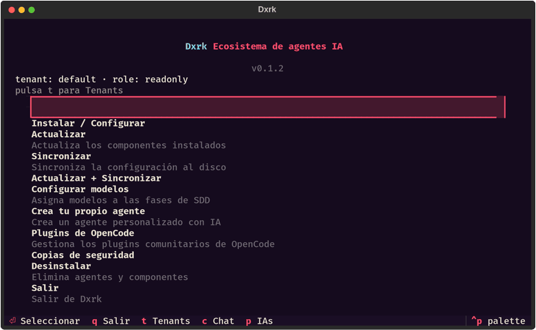

# Multi-tenant en Dxrk



Dxrk aísla todos los datos por tenant bajo un layout de filesystem canónico.
Sin servidor, sin red: solo directorios con permisos restrictivos (diseño
detallado en `adr/ADR-002-memory-separation.md`, roadmap §3.3).

## Layout

```text
~/.dxrk/
├── tenants/
│   ├── _registry.json        # {"tenants": [{"id", "display_name", ...}]}
│   ├── _active               # id del tenant activo (texto plano)
│   └── {id}/
│       ├── palace/           # DxrkMemory 2.0 (sqlite FTS5, WAL 0o600)
│       ├── locks/            # locks de minería
│       ├── learn/            # datos del learner
│       └── sessions/         # sesiones del tenant
```

- Directorios `0o750`, archivos `0o600` (ver `dxrk/tenant/migration.py`).
- El id de tenant se valida con `^[a-zA-Z0-9_-]{1,256}$`
  (`dxrk.security.jwt.validate_id`): sin `/`, `\`, espacios ni `..`.
- `list_tenants()` solo devuelve directorios con nombre válido y ordenados.

## Tenant activo

Prioridad (de mayor a menor):

1. Flag CLI `--tenant/-t` (validado, falla con `SystemExit` si es inválido).
2. Variable de entorno `DXRK_TENANT`.
3. Archivo `tenants/_active`.
4. `default` (tras migración legacy, ver `migration.md`).

El switcher de la TUI (`tenant_switcher`) sigue la misma prioridad:
contexto explícito > entorno > `_active`.

## CLI

```bash
dxrk-py tenant create acme          # crea tenants/acme/ + subdirs
dxrk-py tenant list                 # lista ordenada
dxrk-py tenant switch acme          # escribe _active
dxrk-py tenant current              # muestra el activo
dxrk-py tenant whoami               # activo según flag/env/_active
dxrk-py tenant delete acme --force  # sin --force se niega
dxrk-py tenant migrate              # legacy → tenants/default (idempotente)
dxrk-py --tenant acme <comando>     # cualquier comando bajo ese tenant
```

`create` duplicado es idempotente; `switch` a un tenant inexistente falla.

## Aislamiento verificado

- **Palace/vault/JWT/RBAC/CLI**: `tests/test_tenant_e2e.py` (9 tests).
- **RBAC por rol**: `tests/test_enterprise_rbac_matrix.py` (25 tests).
- **JWT `tid` + vault HKDF**: `tests/test_enterprise_jwt_vault.py` (18 tests).
- **CLI + migración + switcher TUI**: `tests/test_enterprise_cli_migration.py`
  (42 tests, incluye pilot real de la pantalla `tenant_switcher`).

## API

```python
from dxrk.tenant import tenant_root, ensure_tenant, list_tenants, is_migrated

root = ensure_tenant("acme")   # crea skeleton palace/locks/learn/sessions
```

## Vault por tenant

`dxrk/vault/__init__.py` (`TenantVaultRegistry`): cada tenant deriva su clave
con HKDF (`_derive_tenant_key`, 32 bytes) desde la clave maestra
(`DXRK_VAULT_KEY`). Las entradas de `acme` son invisibles para `bob` y
viceversa; la derivación es determinista (mismo tenant, misma clave).
